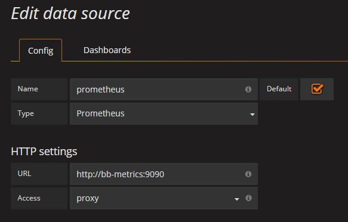
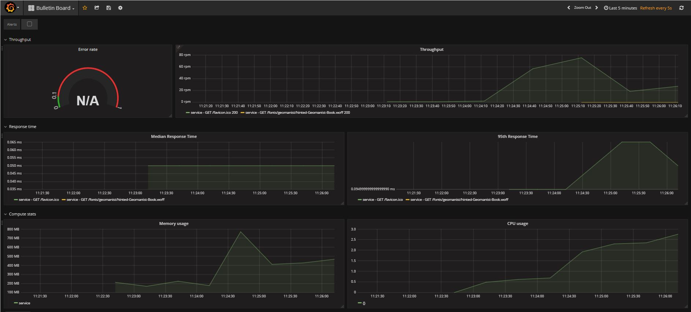

# Node Bulletin Board

A Node.js sample app which shows an event bulletin board, using Vue.js for the front-end and SQL Server for storage. The app runs in containers and the only pre-requisite for building and running the whole stack is Docker.


### Credits

The original app is from [Vue Events Bulletin Board](https://github.com/chenkie/vue-events-bulletin) and the Prometheus integration comes from [Example Prometheus Monitoring](https://github.com/RisingStack/example-prometheus-nodejs).

## Tech Stack

The entrypoint to the app is an Nginx container, which acts as a reverse proxy to the Node.js application container. The application container stores data in the SQL Server container, and it also exposes instrumentation metrics which are scraped by a Prometheus container. The Prometheus metrics are exposed in a dashboard from the Grafana container. 

## Usage

The [Docker Compose](docker-compose.yml) file uses an environment variable for your Docker ID, so you can build the images and push to Docker Hub. Start by capturing your Docker ID in an environment variable:

```
export dockerId='<your-docker-id>'
```

### Build Docker images

Build the application and database images using Docker Compose:

```
docker-compose build
```

### Run the app

You can run the app using the same compose file:

```
docker-compose up -d
```

Browse to [localhost](http://localhost) to use the app.

### Configure Grafana

The compose file runs Prometheus to collect metrics and Grafana to show an application dashbaord. Grfana needs some additional setup.

Browse to [localhost:3000](http://localhost:3000) and log in to Grafana with the credentials `admin` / `admin`. 

Add a new data source with the following details:

- Name: **prometheus**

- Type: **Prometheus**

- URL: **http://bb-metrics:9090**



From the Grafana icon, click _Dashboards... Import_ and load the JSON dashboard file from [bulletin-board-dashboard/dashboard.json](bulletin-board-dashboard/dashboard.json). Select the Prometheus data store.

You'll now see the application dashboard - send some load into the app by refreshing the browser, and the graphs will be populated:



> You can save the configured Grafana container as an image, which persists all the setup changes.

```
docker container commit nodebulletinboard_bb-dashboard_1 $dockerId/bulletin-board-dashboard
```

### Running in swarm mode

You can deploy the app to a Docker swarm for high availability and scale. A single-node swarm is fine for testing.

If you're running the app from compose, first remove all the containers:

```
docker-compose down
```

Switch to swarm mode:

```
docker swarm init
```

> If your Docker host has multiple IP addresses, you'll need to specify the local network IP in the `advertise-addr` option.

Then deploy the application as a stack:

```
docker stack deploy -c docker-stack.yml bb
```

You can browse to the app at the server address, and to the configured Grafana instance at port 3000.